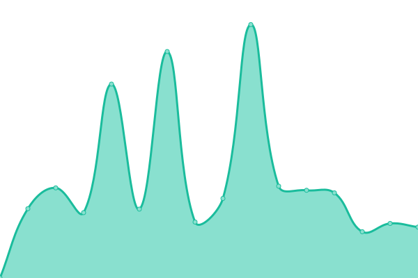

# [📈 Live Status](https://status.fef.moe): <!--live status--> **🟩 All systems operational**

This repository contains the open-source uptime monitor and status page for [fef](https://fef.moe), powered by [Upptime](https://github.com/upptime/upptime).

With [Upptime](https://upptime.js.org), you can get your own unlimited and free uptime monitor and status page, powered entirely by a GitHub repository. We use [Issues](https://github.com/fef1312/status/issues) as incident reports, [Actions](https://github.com/fef1312/status/actions) as uptime monitors, and [Pages](https://status.fef.moe) for the status page.

<!--start: status pages-->
<!-- This summary is generated by Upptime (https://github.com/upptime/upptime) -->
<!-- Do not edit this manually, your changes will be overwritten -->
<!-- prettier-ignore -->
| URL | Status | History | Response Time | Uptime |
| --- | ------ | ------- | ------------- | ------ |
|  [fef's blog](https://fef.moe/) | 🟩 Up | [fef-s-blog.yml](https://github.com/fef1312/status/commits/HEAD/history/fef-s-blog.yml) | 

 662ms
     
 | 

<a href="https://status.fef.moe/history/fef-s-blog">99.40%</a>
    

|  [Garbage Collector](https://gc.fef.moe/login) | 🟩 Up | [garbage-collector.yml](https://github.com/fef1312/status/commits/HEAD/history/garbage-collector.yml) | 

 979ms
     
 | 

<a href="https://status.fef.moe/history/garbage-collector">100.00%</a>
    

|  [Gay Git](https://git.bsd.gay/) | 🟩 Up | [gay-git.yml](https://github.com/fef1312/status/commits/HEAD/history/gay-git.yml) | 

 1098ms
     
 | 

<a href="https://status.fef.moe/history/gay-git">99.40%</a>
    

|  [Gay CI](https://ci.bsd.gay/) | 🟩 Up | [gay-ci.yml](https://github.com/fef1312/status/commits/HEAD/history/gay-ci.yml) | 

 387ms
     
 | 

<a href="https://status.fef.moe/history/gay-ci">99.27%</a>
    

|  [Arch Linux Package Mirror](https://pkg.fef.moe/archlinux/) | 🟩 Up | [arch-linux-package-mirror.yml](https://github.com/fef1312/status/commits/HEAD/history/arch-linux-package-mirror.yml) | 

 185ms
     
 | 

<a href="https://status.fef.moe/history/arch-linux-package-mirror">100.00%</a>
    

|  [SMTP (Asuna)](mail.fef.moe) | 🟩 Up | [smtp-asuna.yml](https://github.com/fef1312/status/commits/HEAD/history/smtp-asuna.yml) | 

 159ms
     
 | 

<a href="https://status.fef.moe/history/smtp-asuna">100.00%</a>
    

|  [DNS 1 (Rem)](78.47.78.184) | 🟩 Up | [dns-1-rem.yml](https://github.com/fef1312/status/commits/HEAD/history/dns-1-rem.yml) | 

 128ms
     
 | 

<a href="https://status.fef.moe/history/dns-1-rem">100.00%</a>
    

|  [DNS 2 (Astolfo)](78.46.85.216) | 🟩 Up | [dns-2-astolfo.yml](https://github.com/fef1312/status/commits/HEAD/history/dns-2-astolfo.yml) | 

 129ms
     
 | 

<a href="https://status.fef.moe/history/dns-2-astolfo">100.00%</a>
    

|  [DNS 3 (Kaho)](188.68.36.246) | 🟩 Up | [dns-3-kaho.yml](https://github.com/fef1312/status/commits/HEAD/history/dns-3-kaho.yml) | 

 127ms
     
 | 

<a href="https://status.fef.moe/history/dns-3-kaho">100.00%</a>
    

<!--end: status pages-->

[**Visit our status website →**](https://status.fef.moe)

## 📄 License

- Powered by: [Upptime](https://github.com/upptime/upptime)
- Code: [MIT](./LICENSE) © [fef](https://fef.moe)
- Data in the `./history` directory: [Open Database License](https://opendatacommons.org/licenses/odbl/1-0/)
